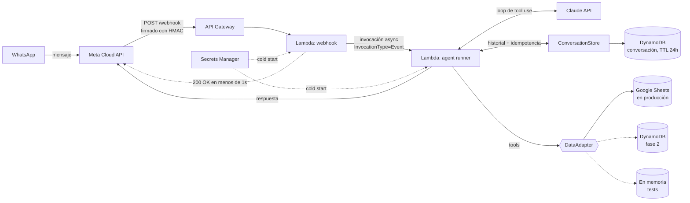

# finanzas-agent

[](https://github.com/nrotsen/finanzas-agent/actions/workflows/ci.yml)

**Un agente de finanzas personales que vive en WhatsApp.** Le escribo qué gasté, qué cobré y qué vence. Claude lo convierte en filas estructuradas en un Google Sheet, responde preguntas sobre mi mes y me avisa antes de cada vencimiento.

Serverless en AWS (API Gateway + dos Lambdas + DynamoDB + Secrets Manager), deployado con SAM, por unos **US$2/mes**.

[Read in English](README.md)

```
yo     › gasté 12k en el super
agente › ¿con qué pagaste? efectivo / débito / crédito / transferencia / mp
yo     › débito
agente › ✅ Registrado: $12.000 en comida (débito).

yo     › cómo voy este mes?
agente › Mayo: ingresos $1.800.000, gastos $950.000. Neto +$850.000.
         Top gastos: alquiler $300k, comida $210k, transporte $45k.
         ⚠️ Vence en 2 días: tarjeta_visa ($280.000).
```

---

## Arquitectura



Dos tipos de estado, separados a propósito. El **estado de la conversación** (historial del chat, último `message_id` procesado) es del runtime y vive en DynamoDB detrás de `ConversationStore`. Los **datos financieros del usuario** (gastos, ingresos, vencimientos) pasan por la interfaz `DataAdapter`; las tools nunca saben qué backend hay abajo.

**Ciclo de un mensaje**

1. Meta hace POST con el mensaje entrante. La Lambda del webhook valida el HMAC de `X-Hub-Signature-256` contra el body crudo, chequea el remitente contra una allowlist e invoca al runner **de forma asíncrona**. Devuelve `200` en menos de un segundo. Meta corta a los ~5s y reintenta, así que hacer el trabajo del LLM en línea generaría mensajes duplicados.
2. El runner carga la conversación desde DynamoDB y corta si ese `message_id` ya fue procesado. Las invocaciones async de Lambda son at-least-once, así que eso hace idempotente todo el pipeline.
3. Corre el **loop de tool use**: Claude elige entre 15 tools (`registrar_gasto`, `marcar_pagado`, `resumen_financiero`…), el runner las ejecuta contra el adapter de datos y le devuelve los resultados, con un tope de 8 iteraciones.
4. La respuesta sale por la Graph API y el historial actualizado se guarda con TTL de 24h. Se limita a 60 mensajes y se trunca respetando los pares de tool calls, para que nunca quede un `tool_result` huérfano de su `tool_use`.

## Decisiones de diseño

| Decisión | Por qué |
|---|---|
| **Dos Lambdas, traspaso async** | Desacopla el deadline de 5s de Meta de la latencia del LLM (120s de presupuesto en el runner). |
| **Interfaz `DataAdapter`** | El agente no sabe dónde viven los datos. Hoy Google Sheets (visible, editable a mano); DynamoDB es un adapter intercambiable. Los tests corren contra un adapter en memoria. |
| **Cliente de LLM fino** | `src/llm/claude_client.py` es el único archivo que conoce a Anthropic. Migrar a Bedrock toca un solo archivo. |
| **Google Sheets como fuente de verdad** | Para un solo usuario, una planilla que puedo abrir y corregir a mano le gana a una base de datos a la que hay que hacerle una UI. |
| **Reglas de negocio en el prompt** | Por ejemplo, *nunca registrar un gasto sin medio de pago*. Barato de iterar y anclado con ejemplos resueltos en el system prompt. |
| **Los vencimientos recurrentes generan el siguiente** | Pagar un fijo mensual registra el gasto *y* crea el vencimiento del mes siguiente, así la lista de avisos se mantiene sola. |
| **SAM en vez de CDK** | Dos funciones y una tabla no necesitan un lenguaje de programación para describirse; `sam local` cubre el testing local. |

## Seguridad

- **Webhooks firmados.** HMAC-SHA256 sobre el body crudo, con comparación en tiempo constante. Falla cerrado si falta el app secret.
- **Allowlist de remitentes, fail-closed.** Solo los números de `ALLOWED_SENDERS` llegan al agente. Si la lista está vacía, se descarta todo.
- **Cero secretos en código o config.** Las API keys, los tokens y los datos personales (el perfil del dueño y los números habilitados) viven en Secrets Manager. Se cargan una vez por cold start.
- **IAM de mínimo privilegio.** Cada función tiene CRUD solo sobre la tabla de conversación y `GetSecretValue` acotado a `finanzas-agent/*`.

## Un bug que vale la pena contar

Los celulares argentinos tienen dos formatos. Los webhooks entregan el moderno (`54 9 11 XXXXXXXX`), pero la whitelist del número de prueba de Meta guarda el legacy (`54 11 15 XXXXXXXX`). Responderle al `wa_id` tal como llegaba fallaba con `#131030 Recipient not in allowed list`, aunque el número estuviera en la whitelist. `normalize_ar_wa_id()` convierte entre los dos formatos. La allowlist compara números normalizados, así que acepta cualquiera de los dos.

## Estructura

```
src/
├── handlers/     Entry points de Lambda (webhook, agent runner)
├── agents/       Loop de tool use, system prompt, perfil del dueño
├── tools/        15 tools que Claude puede llamar: gastos, vencimientos, ingresos
├── adapters/     Interfaz DataAdapter + Google Sheets (+ stub de DynamoDB)
├── llm/          Cliente fino de Anthropic
├── state/        Store de conversación (DynamoDB / en memoria)
├── whatsapp/     Cliente de Graph API de Meta, validación de firma
└── config/       Bootstrap de Secrets Manager
infra/            Template de SAM
tests/            35 tests offline: no necesitan AWS, Sheets ni Anthropic
```

## Correrlo local

```bash
python -m venv .venv && source .venv/bin/activate
pip install -r requirements-dev.txt   # incluye requirements.txt

# 35 tests offline: no tocan AWS, Sheets ni Anthropic
pytest

# Chatear con el agente desde la terminal (necesita un Sheet + API key de Anthropic)
cp .env.example .env   # completar los valores
python -m scripts.chat_cli
```

Guías de setup (en inglés): [Google Sheets](docs/setup-google-sheets.md) · [Meta WhatsApp](docs/setup-meta-whatsapp.md) · [Deploy en AWS](docs/deploy.md)

## Roadmap

- **Ingesta de resúmenes de tarjeta.** Un PDF subido a S3 se procesa con Claude vision y se deduplica por hash. El bucket y la columna `hash_dedup` ya existen.
- **Parser de mails bancarios.** EventBridge dispara la Gmail API y Claude extrae cada transacción.
- **Ruteo multi-agente.** Un solo webhook y varios agentes, cada uno con su adapter; por ejemplo, un agente sobre DynamoDB para un comercio.

## Licencia

[MIT](LICENSE)
