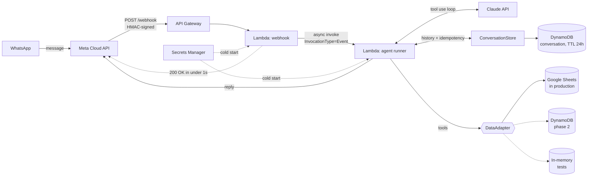

# finanzas-agent

[](https://github.com/nrotsen/finanzas-agent/actions/workflows/ci.yml)

**A personal-finance agent that lives in WhatsApp.** I text it what I spent, what I earned and what's due; Claude turns that into structured rows in a Google Sheet, answers questions about my month, and reminds me before bills are due.

Serverless on AWS (API Gateway + two Lambdas + DynamoDB + Secrets Manager), deployed with SAM, running for about **US$2/month**.

[Leer en español](README.es.md)

```
me    › spent 12k at the supermarket
agent › what did you pay with? cash / debit / credit / transfer / mp
me    › debit
agent › ✅ Logged: $12.000 in food (debit).

me    › how am I doing this month?
agent › May: income $1.800.000, expenses $950.000. Net +$850.000.
        Top: rent $300k, food $210k, transport $45k.
        ⚠️ Due in 2 days: visa card ($280.000).
```

> The agent itself speaks Rioplatense Spanish. The snippet above is translated.

---

## Architecture



Two kinds of state, kept apart on purpose. **Conversation state** (chat history, last processed `message_id`) belongs to the runtime; it lives in DynamoDB behind `ConversationStore`. **The user's financial data** (expenses, income, bills) goes through the `DataAdapter` interface; the tools never know which backend is underneath.

**Request lifecycle**

1. Meta POSTs the incoming message. The webhook Lambda validates the `X-Hub-Signature-256` HMAC against the raw body, checks the sender against an allowlist, and fires the runner **asynchronously**. It returns `200` in well under a second. Meta times out at ~5s and retries, so doing the LLM work inline would produce duplicate messages.
2. The runner loads the conversation from DynamoDB and short-circuits if that `message_id` was already processed. Async Lambda invocations are at-least-once, so this makes the pipeline idempotent.
3. It runs the **tool-use loop**: Claude picks from 15 tools (`registrar_gasto`, `marcar_pagado`, `resumen_financiero`…), the runner executes them against the data adapter and feeds results back, bounded at 8 iterations.
4. The reply goes out through the Graph API, and the updated history is saved with a 24h TTL. History is capped at 60 messages and truncated on tool-call boundaries, so a `tool_result` never gets orphaned from its `tool_use`.

## Design decisions

| Decision | Why |
|---|---|
| **Two Lambdas, async hand-off** | Decouples Meta's 5s deadline from LLM latency (120s budget in the runner). |
| **`DataAdapter` interface** | The agent never knows where data lives. Google Sheets today (visible, hand-editable); DynamoDB is a drop-in adapter. Tests run against an in-memory adapter. |
| **Thin LLM client** | `src/llm/claude_client.py` is the only file that knows about Anthropic. Moving to Bedrock touches one file. |
| **Google Sheets as source of truth** | For a single user, a spreadsheet I can open and fix by hand beats a database I have to build a UI for. |
| **Business rules in the prompt** | e.g. *never log an expense without a payment method*. Cheap to iterate, anchored by worked examples in the system prompt. |
| **Recurring bills generate their successor** | Paying a monthly bill logs the expense *and* creates next month's due date, so the reminder list maintains itself. |
| **SAM over CDK** | Two functions and a table don't need a programming language to describe them; `sam local` covers local testing. |

## Security

- **Signed webhooks.** HMAC-SHA256 over the raw body, with constant-time comparison. It fails closed if the app secret is missing.
- **Sender allowlist, fail-closed.** Only numbers in `ALLOWED_SENDERS` reach the agent. An empty list drops everything.
- **No secrets in code or config.** API keys, tokens and personal data (the owner profile and the allowed numbers) live in Secrets Manager. They are hydrated once per cold start.
- **Least-privilege IAM.** Each function gets CRUD on the conversation table only, and `GetSecretValue` scoped to `finanzas-agent/*`.

## A bug worth telling

Argentine mobile numbers have two formats. Webhooks deliver the modern one (`54 9 11 XXXXXXXX`), but Meta's test-number whitelist stores the legacy one (`54 11 15 XXXXXXXX`). Replying to the `wa_id` exactly as received failed with `#131030 Recipient not in allowed list`, even for a whitelisted number. `normalize_ar_wa_id()` maps between the two formats. The allowlist compares normalized numbers, so either format works.

## Project structure

```
src/
├── handlers/     Lambda entry points (webhook, agent runner)
├── agents/       Tool-use loop, system prompt, owner profile
├── tools/        15 tools Claude can call: expenses, bills, income
├── adapters/     DataAdapter interface + Google Sheets (+ DynamoDB stub)
├── llm/          Thin Anthropic client
├── state/        Conversation store (DynamoDB / in-memory)
├── whatsapp/     Meta Graph API client, signature validation
└── config/       Secrets Manager bootstrap
infra/            SAM template
tests/            35 offline tests: no AWS, Sheets or Anthropic needed
```

## Running it locally

```bash
python -m venv .venv && source .venv/bin/activate
pip install -r requirements-dev.txt   # includes requirements.txt

# 35 offline tests: no AWS, Sheets or Anthropic needed
pytest

# Chat with the agent from the terminal (needs a Sheet + Anthropic key)
cp .env.example .env   # fill in the values
python -m scripts.chat_cli
```

Setup guides: [Google Sheets](docs/setup-google-sheets.md) · [Meta WhatsApp](docs/setup-meta-whatsapp.md) · [Deploy to AWS](docs/deploy.md)

## Roadmap

- **Credit-card statement ingestion.** A PDF dropped in S3 is parsed with Claude vision and deduplicated by hash. The bucket and the `hash_dedup` column already exist.
- **Bank email parsing.** EventBridge triggers the Gmail API, and Claude extracts each transaction.
- **Multi-agent routing.** One webhook, several agents, each with its own adapter, e.g. a DynamoDB-backed agent for a small business.

## License

[MIT](LICENSE)
